# Практическое задание №2

## Введение

Данная работа была выполнена с функционалом и элементами дизайна, не предусмотренными в практическом задании для дополнительного изучения функционала среды разработки Android Studio. Для правильной эксплуатации приложения рекомендуется ознакомиться с данным руководством.

**ВАЖНО:** если изображения загружаются некорректно, необходимо загрузить файл и открыть его в другом визуализаторе.

## Главная страница

Главная страница расположена в модуле App и представляет собой макет ConstraintLayout, состоящий из нескольких элементов - текстовых полей, кнопок и типа отображения элементов. На экране представлены описания заданий и кнопки, ведущие на их решение. Чтобы вернуться обратно на главную страницу, необходимо нажать на верхней панели эмулятора кнопку «назад» (◁).

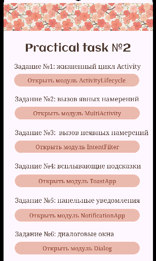

## Задание №1: Создание жизненного цикла Activity

В рамках выполнения данного задания был создан модуль ActivityLifecycle и в нем переопределены основные методы жизненного цикла родительского класса для отслеживания в логах среды Logcat.

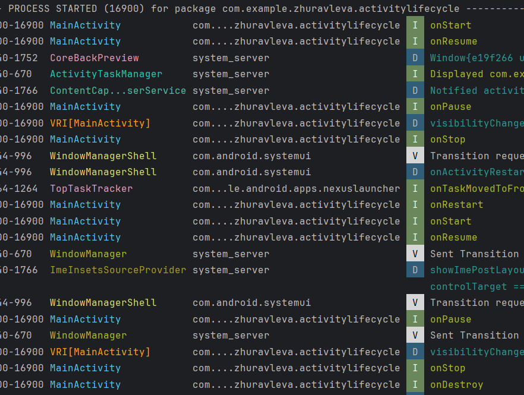

Поле для ввода данных служило для проверки сохранения информации в случае временного закрытия приложения. Также на странице активности представлены ответы на вопросы, полученные опытным путём.

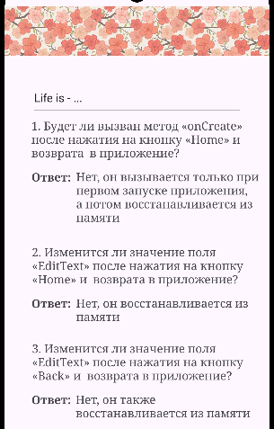

## Задание №2: Создание и вызов явных намерений

В рамках выполнения данного задания был создан модуль MultiActivity, в котором была определена кнопка «StartNewActivity» для открытия второй активности (second_activity), а также поле с текстом и кнопкой «Отправить данные и посмотреть итог» для отправки данных во вторую активность.

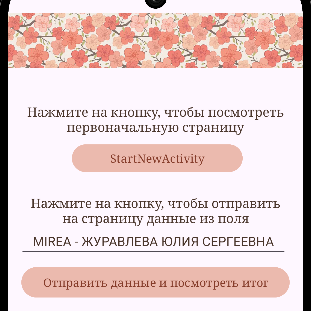

При нажатии на кнопку «StartNewActivity» открывается пустая активность без данных, которые нужно отправить отдельно.

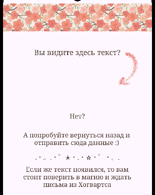

При нажатии на кнопку «Отправить данные и посмотреть итог» открывается активность c отправленными данными - своим ФИО. Магия, не иначе...

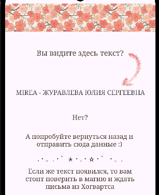

## Задание №3: Создание и вызов неявных намерений

В рамках выполнения данного задания был создан модуль IntentFilter, в котором была определена кнопка «Открыть сайт университета» и «Поделиться своим ФИО с другим приложением»

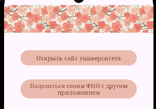

При нажатии на кнопку «Открыть сайт университета» в браузере открывается сайт mirea.ru.

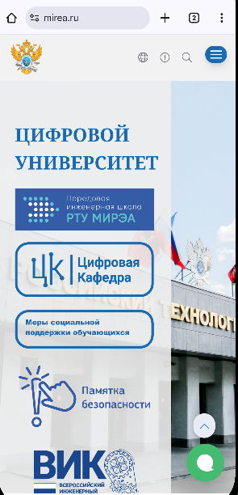

При нажатии на кнопку «Поделиться своим ФИО с другим приложением» открывается всплывающее окно с текстом, которым нужно поделиться и выбором приложения для отправки.

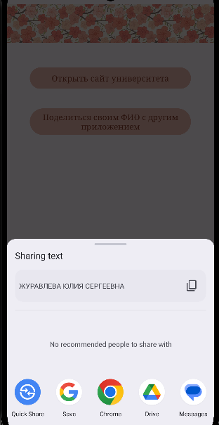

## Задание №4: Создание всплывающей подсказки

В рамках выполнения данного задания был создан модуль ToastApp, в котором было определено поле для ввода информации и кнопка «Посчитать символы».

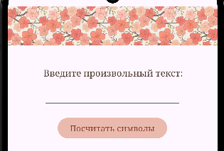

При нажатии на кнопку символы в строке подсчитываются и выводится сообщение о количестве знаков вместе с дополнительной информацией.

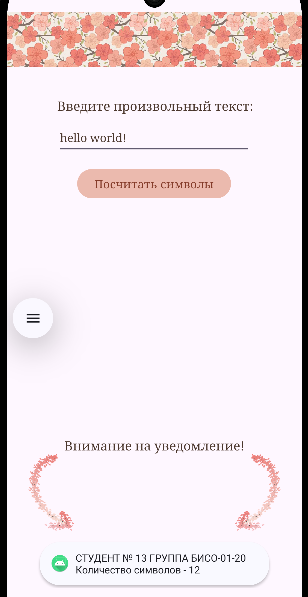

## Задание №5: Создание панельного уведомления

В рамках выполнения данного задания был создан модуль NotificationApp, в котором была определена кнопка «SEND NOTIFICATION».

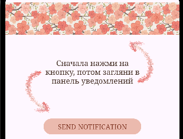

После нажатия на кнопку можно услышать характерный звук появившегося уведомления. Открыв панель уведомлений увидим уже раскрытое уведомление с заданным текстом.

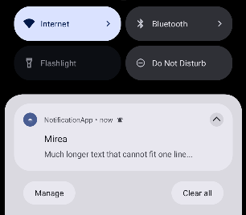

Однако, если это уведомление свернуть до короткого состояния с помощью стрелки в правом верхнем углу уведомления, то там появится другой короткий текст.

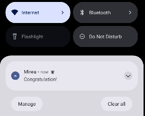

## Задание №5: Создание диалогового окна

В рамках выполнения данного задания был создан модуль Dialog, в котором были определены кнопки «Show dialog», «Time Dialog», «Date Dialog» и «Progress Dialog».

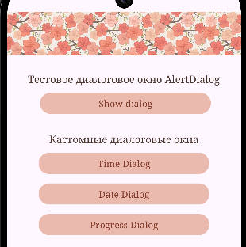

При нажатии на кнопку «Show dialog» появляется диалоговое окно AlertDialog с тремя вариантами ответа - нейтральное «На паузе», отрицательное «Нет» и положительное «Иду дальше».

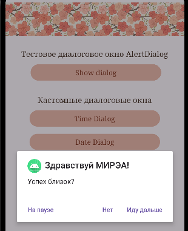

При выборе одного из вариантов ответа появляется всплывающее уведомление, которое показывает наш выбор.

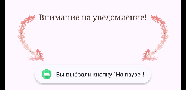

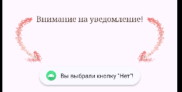

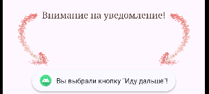

Далее рассмотрим кастомную кнопку «Time Dialog». При нажатии нам предлагается выбрать нужное время. По умолчанию стоит время с устройства.

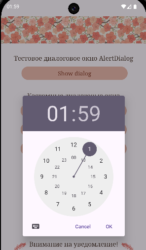

После выбора времени появляется всплывающая подсказка и виджет snackbar с информацией о выборе.

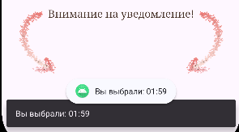

Далее рассмотрим кастомную кнопку «Date Dialog». При нажатии нам предлагается выбрать нужную дату. По умолчанию стоит дата с устройства.

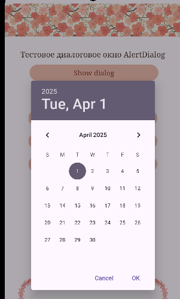

После выбора стандартно появляется всплывающая подсказка и виджет snackbar с выбранной датой.

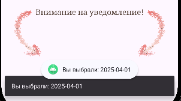

Далее рассмотрим завершающую кастомную кнопку «Progress Dialog». При нажатии на неё высвечивается бесконечная загрузка, на которую в будущем можно поставить некоторый процесс. Одновременно с ней появляется всплывающая подсказка и виджет snackbar с информацией о загрузке.

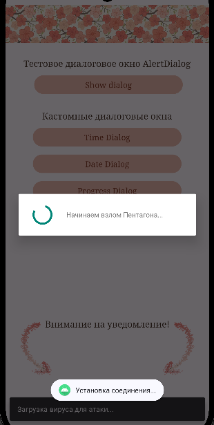
