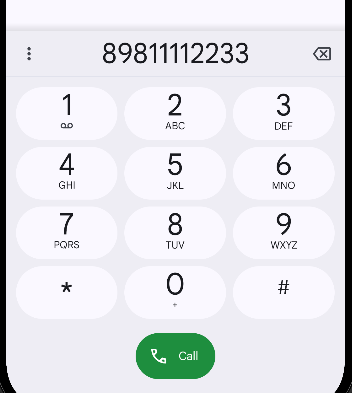

# Практическое задание №3

## Введение

Данная работа была выполнена с функционалом и элементами дизайна, не предусмотренными в практическом задании для дополнительного изучения функционала среды разработки Android Studio. Для правильной эксплуатации приложения рекомендуется ознакомиться с данным руководством.

**ВАЖНО:** если изображения загружаются некорректно, необходимо загрузить файл и открыть его в другом визуализаторе.

## Главная страница

Главная страница расположена в модуле App и представляет собой макет ConstraintLayout, состоящий из нескольких элементов - текстовых полей, кнопок и типа отображения элементов. На экране представлены описания заданий и кнопки, ведущие на их решение. Чтобы вернуться обратно на главную страницу, необходимо нажать на верхней панели эмулятора кнопку «назад» (◁).

## Задание №1: Передача данных с помощью Intent

В рамках выполнения данного задания был создан модуль IntentApp и в нем были реализованы 2 активности. В первую передаётся дата и время устройства и задаётся число - номер по списку. Затем при создании первой активности, сразу открывается вторая и выводит на экран квадрат номера по списку, текущую дату с временем устройства.

Если нажать на кнопку «назад», можно вернуться в первую активность и увидеть только текущую дату с временем устройства.

## Задание №2: Обмен данными с другими приложениями

В рамках выполнения данного задания был создан модуль Sharer, который сразу предлагает поделиться информацией с другими приложениями.

Если нажать на кнопку «назад», то можно вернуться в первую активность и увидеть текст, который сразу и не заметишь при запуске модуля Sharer.

## Задание №3: Получение данных из другой активности

В рамках выполнения данного задания был создан модуль FavoriteBook, в котором определено текстовое поле и кнопка для отправки данных. 

При нажатии на кнопку, открывается вторая активность, в которой есть 2 поля для ввода текста и кнопка для отправки данных обратно в первую активность.

При нажатии на кнопку отправки данных, возвращаемся обратно в первую активность и получаем информацию о любимой книге и цитатах с учётом введённых данных.

## Задание №4:Вызов системных приложений

В рамках выполнения данного задания был создан модуль SystemIntentsApp, в котором было определено 3 кнопки с различным функционалом - позвонить по указанному номеру, открыть в браузере заданный сайт и открыть карту с заданными координатами.

При нажатии на кнопки выполняется функционал, который был задан каждой из них через обработку нажатий setOnClickListener.

## Задание №5: Реализация фрагментов приложения

В рамках выполнения данного задания был создан модуль SimpleFragmentApp, в котором была определены 2 кнопки, которые при нажатии открывают соответствующие фрагменты. 

Первая кнопка открывает первый фрагмент, вторая кнопка открывает второй соответственно

Однако, если экран повернуть в горизонтальное положение, кнопки пропадут и оба фрагмента будут отображены на одном экране.

## Задание №6: Контрольное задание

В рамках выполнения данного задания был создан модуль MireaProject по шаблону Navigation Drawer Activity. Внутри модуля было добавлено 2 фрагмента: DataFragment (с уникальной информацией) и WebViewFragment (со страницей браузера).

При открытии фрагментов из меню «гамбургера», можно ознакомиться с информацией о требованиях Material You и открыть страницу РТУ МИРЭА внутри приложения.

