# Практическое задание №4

## Введение

Данная работа была выполнена с функционалом и элементами дизайна, не предусмотренными в практическом задании для дополнительного изучения функционала среды разработки Android Studio. Для правильной эксплуатации приложения рекомендуется ознакомиться с данным руководством.

**ВАЖНО:** если изображения загружаются некорректно, необходимо загрузить файл и открыть его в другом визуализаторе.

## Главная страница

Главная страница расположена в модуле App и представляет собой макет ConstraintLayout, состоящий из нескольких элементов - текстовых полей, кнопок и типа отображения элементов. На экране представлены описания заданий и кнопки, ведущие на их решение. Чтобы вернуться обратно на главную страницу, необходимо нажать на верхней панели эмулятора кнопку «назад» (◁).

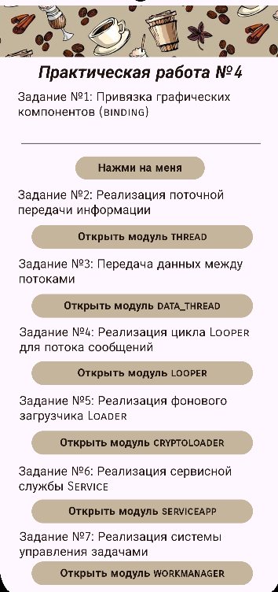

## Задание №1: Привязка графических элементов с помощью Binding

В рамках выполнения данного задания внутри основной активности (app) было создано поле editView и кнопка, которая выводит на экран наш номер по списку.

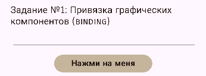

## Задание №2: Реализация поточной передачи информации

В рамках выполнения данного задания был создан модуль Thread, который сразу показывает нам имя текущего потока (main) и имя нового, которое мы задаём самостоятельно.

Если нажать на кнопку «Запуск потоков», то в логах Logcat по тэгу ThreadProject можно увидеть процесс запуска потоков.

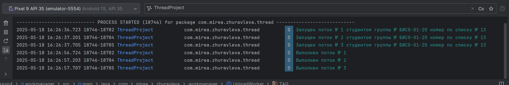

Чуть ниже на основном экране расположено 2 поля для ввода и кнопка. По заданию необходимо посчитать среднее количество пар за месяц. 

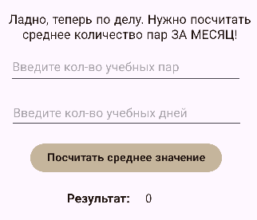

После ввода данных нажимаем на кнопку подсчёта и получаем итоговый результат, округлённый до целого.

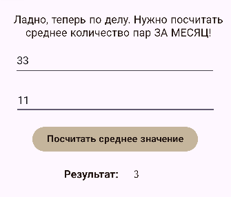

## Задание №3: Передача данных между потоками

В рамках выполнения данного задания был создан модуль Data_Thread, в котором описываются различные методы и как они работают. Текстовое поле «Смотри сюда!» будет меняться в зависимости от установленного времени.

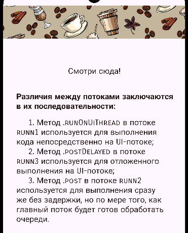

## Задание №4: Реализация цикла Looper для потока сообщений

В рамках выполнения данного задания был создан модуль Looper, в котором было определено 2 поля для ввода данных, кнопка и поле для вывода данных о номере по списку.

**Важно!** \
В поле возраст на этапе тестирования лучше писать маленький, так как задержка между запросами = возрасту.

После заполнения полей нужно нахать на кнопку и в логах Logcat отфильтровать записи по фразе «MyLooper». Так мы увидим, что данные передались. 

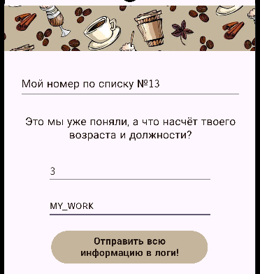

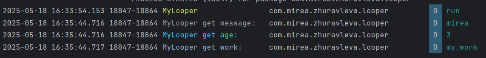

А что делать с принимаемыми данными? Всё просто - нужно изменить фильтр на «MainActivity». Там мы увидим уже принятые данные, которые были подставлены в общую строку.

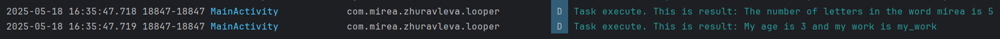

## Задание №5: Реализация фонового загрузчика Loader

В рамках выполнения данного задания был создан модуль CryptoLoader, в котором было определено ,поле для ввода текста и кнопка для его отправки.

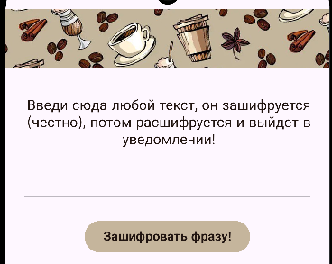

После ввода фразы и её отправки, она шифруется с помощью  алгоритма AES и передается вместе с ключом в «Loader». В «Loader» происходит дешифровка фразы и последующая передача в «MainActivity». Дешифрованная фраза отображается с помощью «toast».

## Задание №6: Реализация сервисной службы Service

В рамках выполнения данного задания был создан модуль ServiceApp, внутри которого был реализован работающий макет медиаплеера. 

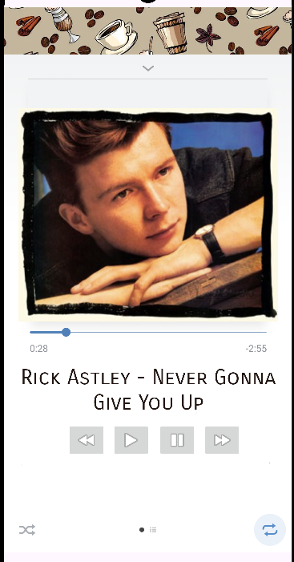

При нажатии на кнопку «play», начинала играть музыка (ах да, поздравляю, вы были зарикроллены), а при нажатии на «pause» - она останавливалась. Остальные кнопки были сделаны чисто для красоты.

Также при нажатии на «play» появлялось уведомление с названием трека в раскрытом состоянии.

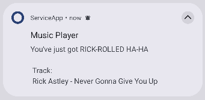

В скрытом состоянии оно менее информативное.

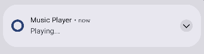

## Задание №7: Реализация системы управления задачами

В рамках выполнения данного задания был создан модуль WorkManager, внутри которого из функционала не было ничего. Всё выполнение отражается в логах Logcat. 

Если запускать на витруальном устройстве, то для просмотра нужно убрать все проверки на заряд и наличие интернета. Если на физическом устройстве, то проблем не возникнет и с проверкой. Нужные нам записи появятся после фильтрации по тегу «UploadWorker».

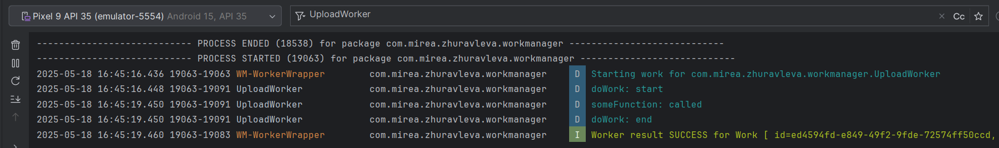

## Задание №8: Контрольное задание

В рамках выполнения данного задания был создан отдельный проект MireaProject. В нём был создан фрагмент, в котором были реализованы проверки по 4 параметрам - наличию интернета, процесса и уровня зарядки, количества оставшегося свободного места на устройстве.

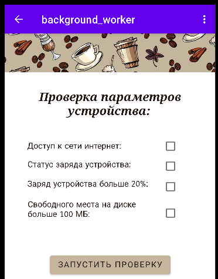

При нажатии на кнопку, чекбоксы параметров активировались, если проверка была успешно пройдена.

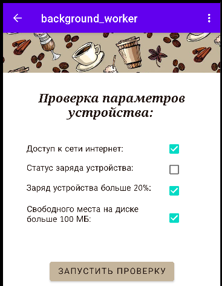
