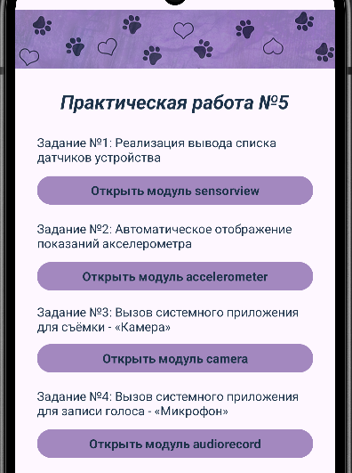
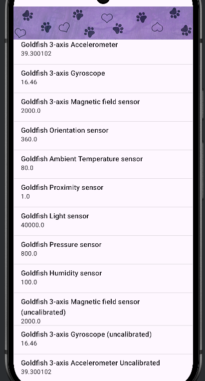
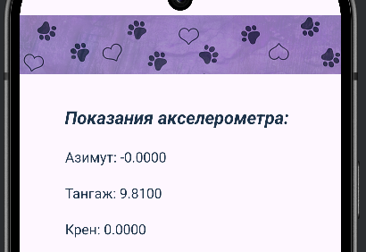
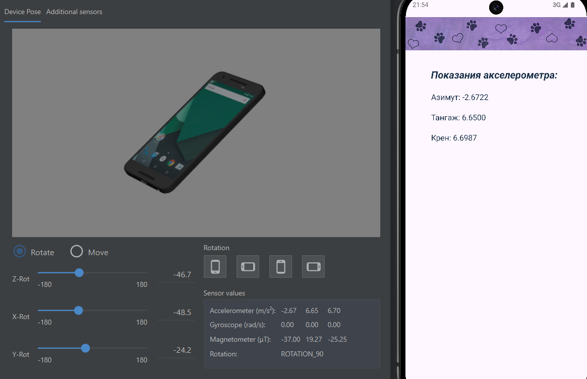
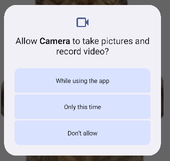
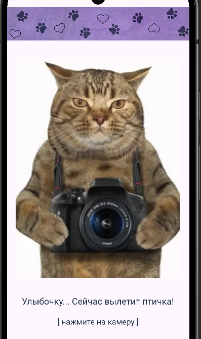
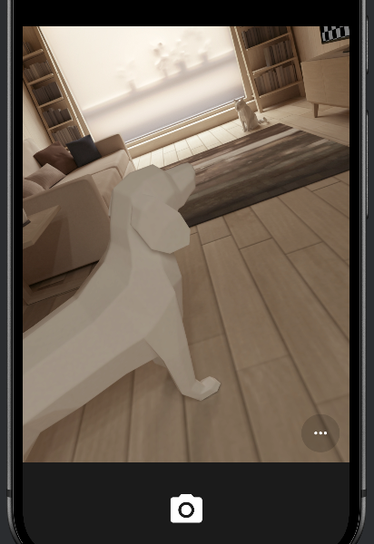
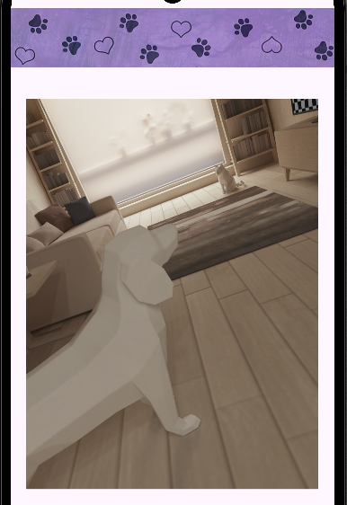
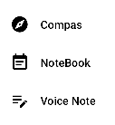
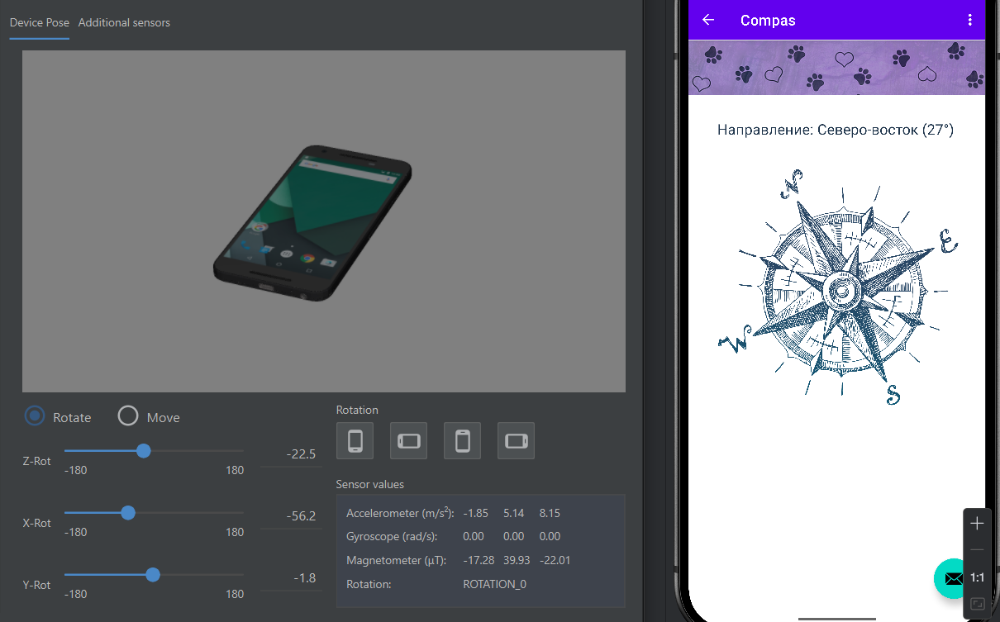

# Практическое задание №5

## Введение

Данная работа была выполнена с функционалом и элементами дизайна, не предусмотренными в практическом задании для дополнительного изучения функционала среды разработки Android Studio. Для правильной эксплуатации приложения рекомендуется ознакомиться с данным руководством.

**ВАЖНО:** если изображения загружаются некорректно, необходимо загрузить файл и открыть его в другом визуализаторе.

## Главная страница

Главная страница расположена в модуле App и представляет собой макет ConstraintLayout, состоящий из нескольких элементов - текстовых полей, кнопок и типа отображения элементов. На экране представлены описания заданий и кнопки, ведущие на их решение. Чтобы вернуться обратно на главную страницу, необходимо нажать на верхней панели эмулятора кнопку «назад» (◁).

## Задание №1: Реализация вывода списка датчиков устройства

В рамках выполнения данного задания внутри активности SensorView было создано поле ListView, которое выводит на экран список поддерживаемых датчиков на устройстве.

## Задание №2: Автоматическое отображение показаний акселерометра

В рамках выполнения данного задания был создан модуль Accelerometer, который показывает нам значения датчиков акселерометра - азимут, тангаж и крен.

В дополнительных настройках устройства повращаем телефон и увидем как меняются параметры аксетерометра.

## Задание №3: Вызов системного приложения для съёмки - «Камера»

В рамках выполнения данного задания был создан модуль Camera, в котором реализована кнопка ImageButton, открывающая окно камеры. Однако перед этим обязательно нужно спросить пользомателя на использование камеры.

Только посмотрите какой совершенно не уставкий котик-фотограв горит желанием сфотографировать вас!

При нажатии на фотоаппарат открывается окно камеры и виртуальное пространство за ней. Там можно разглядеть собаку и кота поодаль.

После сохранения кадра он заменит изображение котика.

## Задание №4: Вызов системного приложения для записи голоса - «Микрофон»

В рамках выполнения данного задания был создан модуль AudioRecord, в котором были определены 2 кнопки для записи голоса и воспроизведения записи. 

Для начала по стандарту запрашиваем разрешение у пользователя.

 /

При нажатии на первую кнопку, начнётся запись и изменится надпись на кнопке. В это время вторая кнопка будет заблокирована. 

Затем останавливаем запись и воспроизводим её. В этот момент первая кнопка будет заблокирована.

## Задание №5: Реализация персональных страниц в MireaProject

В качестве персональных страниц было выбрано 3 темы - компас, текстовая заметка и запись голосовой заметки.

### Компас, зависящий от положения телефона

Устройство компаса считывает положение акселерометра и магнитометра и показывает стороны светы, куда направлено устройство. Картинка компаса двигается в соответствии со стороной света.

### Запись текстовой заметки с возможностью прикрепления картинки

Для начала система запрашивает необходимые разрешения.

 /

Затем можем ознакомиться с основным интерфейсом заметки - область для загрузки фотографии, место для описания задачи и отметка о статусе выполнения.

При нажатии на пиктограмму открывается камера.

После сохранения фотографии можно добавить её в саму заметку.

### Запись голосовой заметки

Сначала по стандарту приложение спрашивает все необходимые разрешения.

 /

Интерфейс практически аналогичен предыдущему подобному заданию. 

При нажатии на первую кнопку, начнётся запись и изменится надпись на кнопке. В это время вторая кнопка будет заблокирована. 

Затем останавливаем запись и воспроизводим её. В этот момент первая кнопка будет заблокирована.

